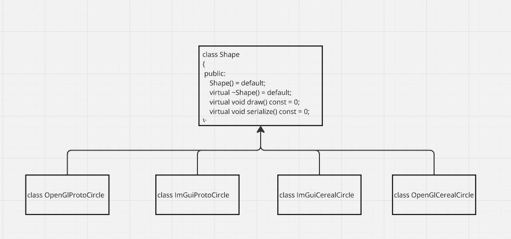

# object oriented approach

## build and run:
```bash
bazel run //:object_oriented_approach
```


## pros:
- you can easily add new types without recompiling existing code
- fulfills OCP (open closed principle)

## good software design?
Imagine half a year later, we need a serialize function...



## cons:
- shape interface can not extend easily with new operations
- if you add a new operation, all classes have to implement it
- strong dependency to a gui library - what if you just want to use a Circle for geometric calculation?


## book - Guideline 15: 
- Prefer an object oriented solution, when you primarily want to add types
- Prefer a procedural / functional solution when you primarily want to add operations

  


